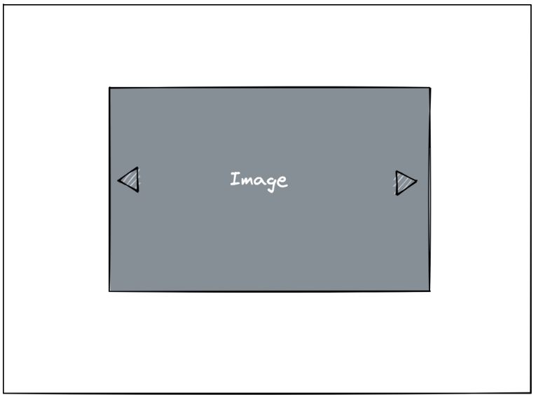

# Image Carousel

Create an image carousel that cycles through images fetched from an endpoint (displaying a new image every 3 seconds),
and allows the user to skip to the next/previous image.

Below is a mockup of what the UI should look like (the carousel should be horizontally centered, with at least some
top margin):

