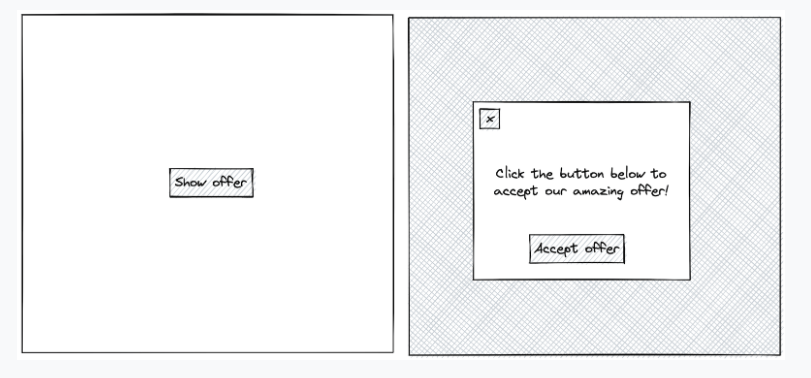
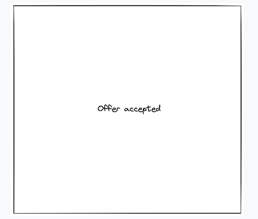

# Modal Overlay

Create a dismissible modal overlay. The UI should initially show a 'Show offer' button which, when clicked, displays
an overlay resembling the mockup below, including a transparent grey overlay over the background. The modal should be
vertically and horizontally centered, and always in the same position regardless of scrolling.

If the user clicks anywhere on the grey background or the 'x', the modal should be dismissed and the UI should again
just show the 'Show offer' button. However, if the user clicks the 'Accept offer' button, the modal will dismiss and
the UI should now show the text "Offer accepted".

