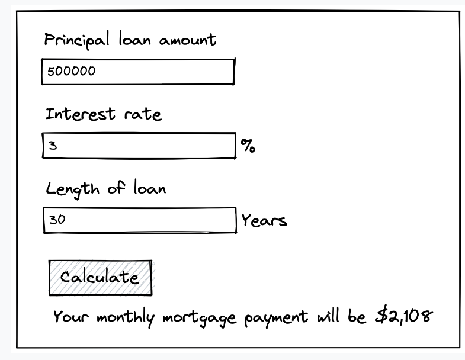

# Mortgage Calculator

Create a calculator that accepts three inputs and calculates your monthly mortgage payment:

1. Principal loan amount
2. Interest rate (annual)
3. Number of years on your mortgage

The standard math equation for calculating your monthly mortgage payment is:

`P(r(1+r)^n/((1+r)^n)-1))`

Where:

- `P` is the principal loan amount
- `r` is the monthly interest rate
- `n` is the total number of payments on your mortgage

**Note the bolded differences** between the equation variables and the inputs. The inputs are set up that way as a matter
of user experience: borrowers tend to be presented numbers like this by their bank. Your job when working on this feature
is to convert the user inputs into the numbers that will be used in the calculation. Users will make 12 payments on their
mortgage per year of their mortgage, and the monthly interest rate is the annual interest rate divided by 12.

