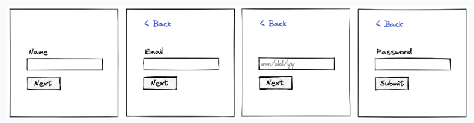

# Multi-Step Form

Your PM has asked you to create the most annoying signup form in the world: a form that has
4 fields but on a series of 4 different screens. Your name, email, date of birth, and password will be entered
separately into the site:



The specs are as follows:

1. Back links appear on every screen other than the first one, going back to the step the user was just on
2. Input is required on every screen prior to proceeding to the next.
3. On the last screen, provide a submit button that calls a ```js handleSubmit({ name: ..., email: ..., password: ... })```
function passing in the values of all the fields
4. Show a success screen

## Notes about the form structure:

For the form logic, we'll use the React Hook Form library, which greatly simplifies working with forms.
For the central store, we'll use React Context, although a separate state management library (e.g., Redux) could be a
better fit for more complicated cases. Lastly, each form step will have its own route, for which we'll use React Router.

To summarize, the app flow is as follows:

- Each step is a separate form with its own handlers and local state.
- Pressing Next submits the data from the current step to the centralized store and redirects to the route for the next step.
- At the final step, all the data is shown, and users can edit any of the steps before submitting.
