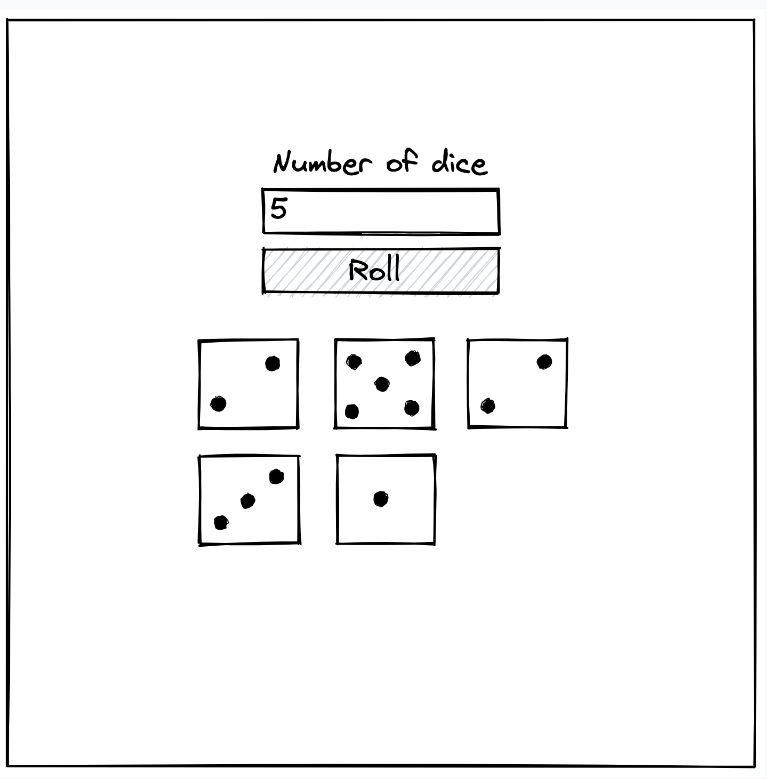
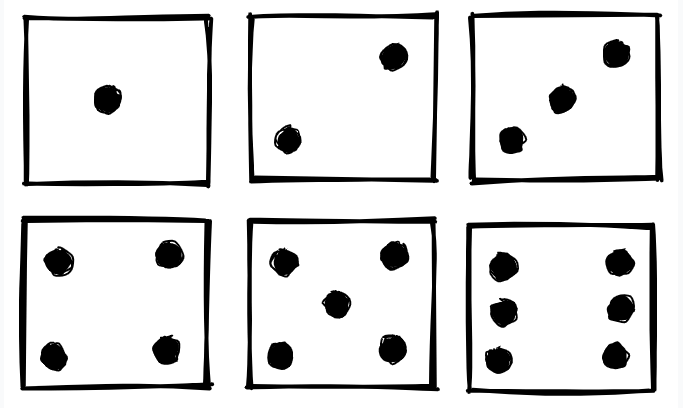

# Rolling Dice

Create a dice roller application that can roll anywhere from 1-99 six-sided dice. The dice should be displayed in
rows of three, wrapping as needed.

The faces should look as follows:

