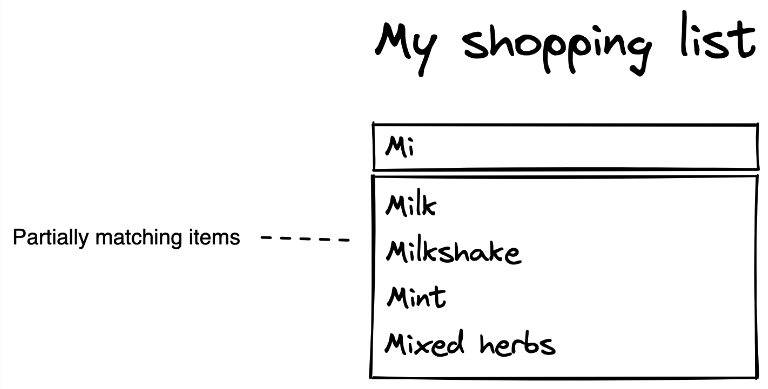
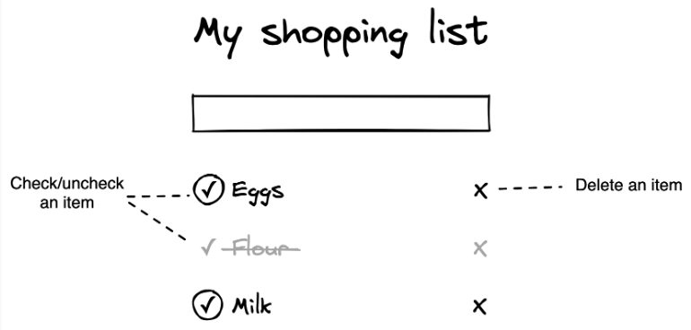

# Shopping List

Create a shopping list application that allows a user to search for an item, add items, check them off, and delete them

As the user starts typing, it should hit the endpoint and show a list of partial matches. Clicking an item should add
it to the list.

Added items can be checked off, unchecked again, and deleted from the list.

## Requirements

- Entering more than two characters in the input should show a list of partially matching items (starting with the same characters)
- Clicking an item in the list of partially matching items should add it to the list
- Adding the same item multiple times is allowed
- Pressing the 'X' next to an item should delete it from the list
- Pressing the '✓' next to an item should check it off (i.e. strikethrough text and partially grey out text/buttons)
- Pressing the '✓' next to a checked-off item should uncheck it again