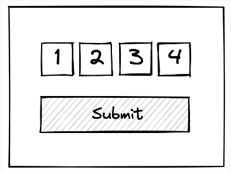

# Two-factor Code Input

Create a 4-digit security code input that allows you to enter a two-factor authorization code.
It should resemble the screenshot below:

mplement a form submission handler that calls a submitCode(code) function with the 4 digits as a concatenated string.
Implement a submitCode function that validates the code given against a hardcoded 4-digit string.

The inputs should be as usable as possible, specifically:

1.Each field should allow only one digit between 0-9. Any other input should be rejected
2. Entering a number in a field should advance the cursor to the next field, except in the case of the last field
3. Pressing backspace at the beginning of a field (whether that field is populated or not) should focus the previous field and delete the input inside
4. Very basic styling guidance:
    - Inputs should be positioned next to one another
    - Inputs should be roughly rectangular as pictured
    - Submit button should be positioned below