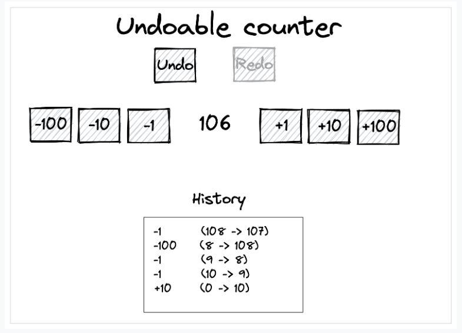

# Undoable Counter

Create a simple counter with a history, and the ability to undo/redo changes

## Requirement

- The count should begin at 0
- Clicking the +1, +10, +100 buttons should add 1, 10, and 100 to the count, respectively
- Clicking the -1, -10, -100 buttons should subtract 1, 10, and 100 from the count, respectively
- Clicking any + or - button should show a new entry in the history, in the format: ACTION (BEFORE -> AFTER) (e.g. +1 (0 -> 1))
- Clicking the 'Undo' button should undo the last action. For example, if the user just clicked '+10', clicking undo should subtract 10 from the count
- The user should be able to undo up to the last 50 actions
- The 'Redo' button should be greyed out until the user clicks 'Undo'
- Clicking the 'Redo' button should redo the last action the user undid. For example, if the user clicked '+10', clicking undo would subtract 10, then clicking redo would add 10 again
- Clicking undo/redo should remove and re-add entries to the history respectively
